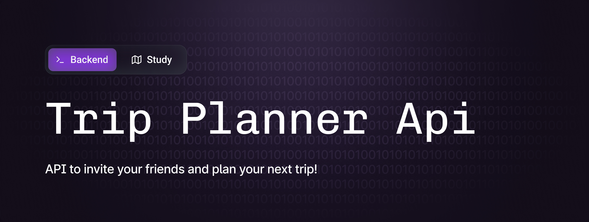
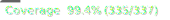

> Todo list
- [x] Criar dockerfile e melhorar o docker compose
- [ ] Adicionar cors
- [x] Remover o sqlite e passar a usar o postgres
- [ ] Remover do historico do git o sqlite
- [ ] Criar um readme, ensinando como subir o projeto
- [ ] Validar o BullMq e sua implementação
- [ ] Pensar na implementação de uma interface do whatsapp
